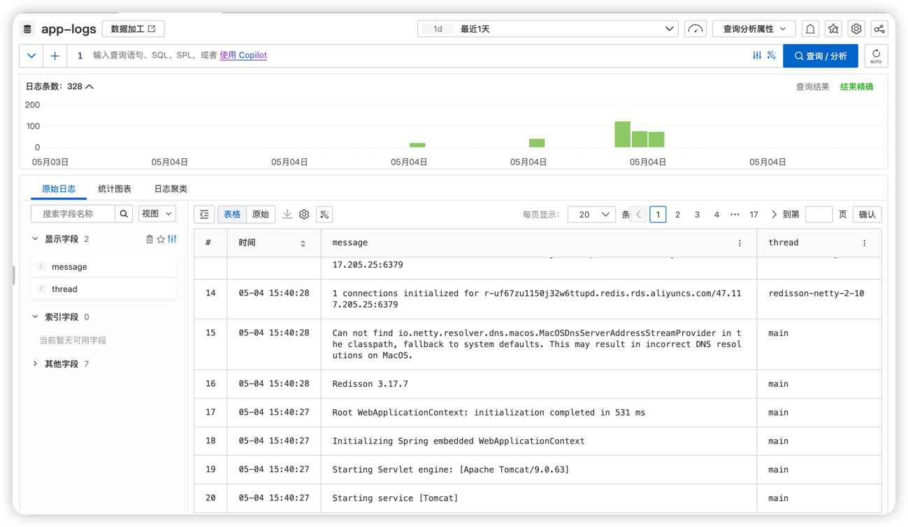

# Deploy To K8S
## Aim
deploy the application to Ali Yun ACK from local

## pre requirement
1. you should install kubectl command tools in your local
2. you should update the ~/.kube/config file with your ACK auth

## Steps
### check the kubectl command
```shell
# make sure your kubectl command is ok
kubectl get namespaces
```

### login to ali yun acr and build docker image
```shell
# login to aliyun acr
docker login --username=${your-aliyun-account-email} registry.cn-shanghai.aliyuncs.com

# update application version
export APP_VERSION=1.1.0
mvn versions:set -DnewVersion=${APP_VERSION}
mvn clean package -Dmaven.test.skip=true

# now you have the spring boot jar, build docker image
docker build --platform=linux/amd64 -t fraud-detect:${APP_VERSION} .

# tag for the ali acr repo
docker tag fraud-detect:${APP_VERSION} registry.cn-shanghai.aliyuncs.com/hsbc-202505/fraud-detect:${APP_VERSION}
docker push registry.cn-shanghai.aliyuncs.com/hsbc-202505/fraud-detect:${APP_VERSION}

```

### prepare the k8s secret for some sensitive config
you can config it via yaml or web UI. as this is a public repo, so i created it via UI.
there are some secret env should be config:
1. ALI_KEY
2. ALI_SECRET
3. SPRING_REDIS_PASSWORD

### prepare the docker secret for k8s pull image

you should config secret with key `.dockerconfigjson` and value should the base64 string of json 
```json
{"auths":{"registry-vpc.cn-shanghai.aliyuncs.com":{"username":"your-aliyun-account-email","password":"the-password-for-acr"}}}
```

### deploy the k8s
just run the command
```shell
# update the image version, you can change the yaml manually if there is no yq
yq -i '.spec.template.metadata.labels.version = env(APP_VERSION)' k8s/aliyun/deployment.yaml
yq -i '.spec.template.spec.containers[0].image = "registry-vpc.cn-shanghai.aliyuncs.com/hsbc-202505/fraud-detect:" + env(APP_VERSION)' k8s/aliyun/deployment.yaml
kubectl apply -f  k8s/aliyun/deployment.yaml
kubectl apply -f  k8s/aliyun/hpa.yaml
kubectl apply -f  k8s/aliyun/service.yaml
```

## Results
after deploy the application to k8s, you can create an other pod to access the service
### call the service
```shell
kubectl run -i --tty --rm test-pod --image=alibaba-cloud-linux-3-registry.cn-hangzhou.cr.aliyuncs.com/alinux3/alinux3:latest /bin/bash
curl http://fraud-detect-svc/actuator
```

### watch the logs
the logs can be view in ACK console or in the ali SLS project `fraud-detect`,eg
https://sls.console.aliyun.com/lognext/project/fraud-detect/logsearch/app-logs?slsRegion=cn-shanghai


