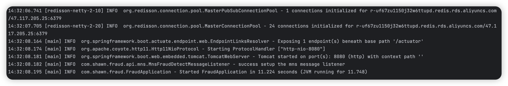

# Quick Start
## Aim
start up the application in local.
## pre requirement
1. make sure java version >= 11
2. prepare your aliyun acess key and secret
3. make sure ali yun service can be access from your local
## Steps
1. run maven to build spring boot jar
```shell
mvn clean package -Dmaven.test.skip=true
export ALI_KEY=your-aliyun-access-ley
export ALI_SECRET=your-aliyun-access-secret
export SPRING_REDIS_PASSWORD=your-aliyun-redis-password
jar -jar target/fraud-detector-1.0.0.jar 
```
## Result
you will see the application startup successfully, eg:


then, send a test request
```shell
curl --location 'http://localhost:8080/api/transactions/fraud/detect' \
--header 'x-request-id: 6d300cd1-0650-42c4-83cb-76063bf0a905' \
--header 'Content-Type: application/json' \
--data '{
    "id": "6d300cd1-0650-42c4-83cb-76063bf0a905",
    "amount": 2000,
    "age": 16,
    "country": "china"
}'
```
response with
```json
{"success":false,"error":"TOO_BIG_AMOUNT"}
```
after COMMAND+C key press, the application stop gracefully
