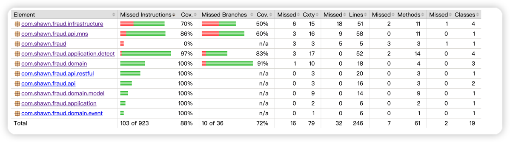

# Unit Test
## Aim
run the unit test in local and generate coverage report

## Steps
run the mvn command
```shell
mvn clean verify
```

## Result
see the report at `target` dir
```shell
open target/reports/surefire.html
open target/jacoco-report/index.html
```
the coverage report will be like
